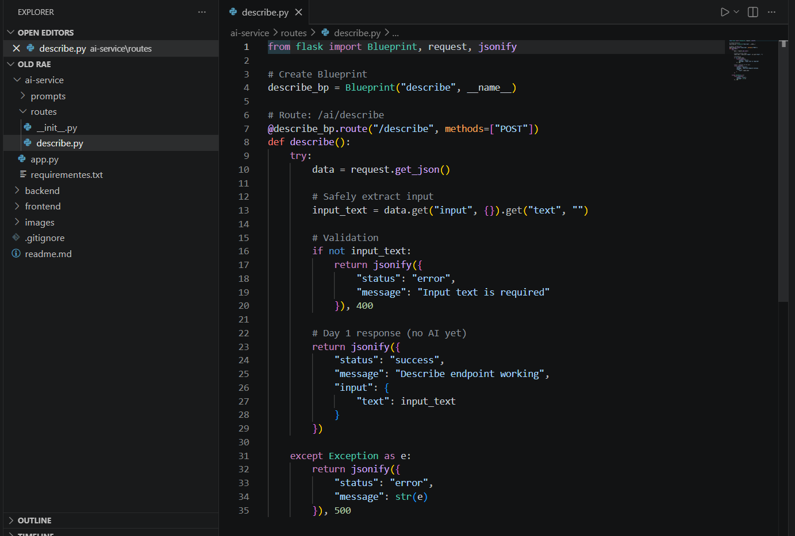

Risk Assessment Engine

Internship Work – AI Developer 1

Name: Ayesha Siddiqa
Role: AI Developer 1
Project: Risk Assessment Engine

Day 1 Progress — Risk Assessment Engine

📌 Work Completed
On Day 1, the initial setup of the Risk Assessment Engine project was completed.

✅ Tasks Done:

1.Initialized Flask application
2.Created core project entry point (app.py)
3.Configured and registered Flask blueprints
4.Created modular folders for future development:
5.routes/ for API endpoints
6.services/ for business logic
7.prompts/ for AI prompt handling
8.Set up requirements.txt for project dependencies

Day-1 Screenshorts

1. Flask Application Entry Point (app.py)
   
   Description: This file initializes the Flask application and registers all blueprints from the routes folder. It acts as the main entry point of the Risk Assessment Engine backend.

2. Risk Analysis API Endpoint (describe.py)

   Description: This file contains the API logic that receives input data from users, processes it, and returns a risk analysis response. It acts as the core service layer for handling requests.

   

3. API Response Output in Postman(Endpoints Check)

   

4. API Response Output in Postman(Health check)

   

4. API Response Output in Browser(HEalth check)

   

🎯 Outcome

A basic Flask backend structure was successfully established, providing a foundation for building API routes and integrating risk assessment logic in upcoming stages.